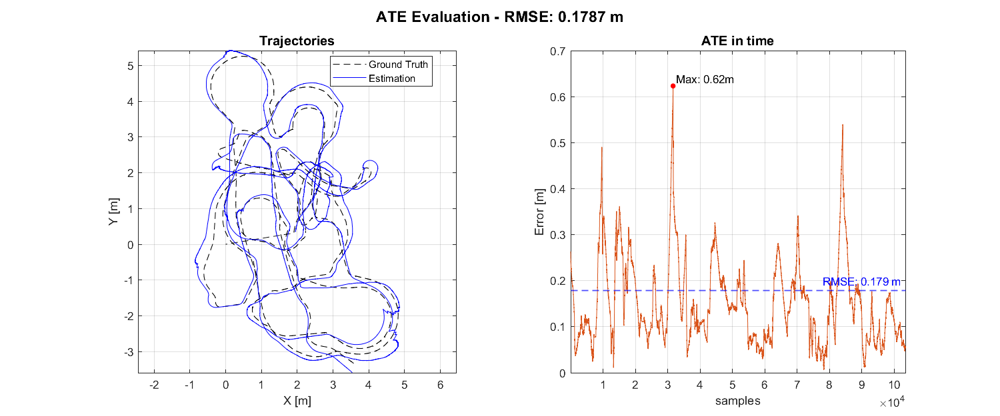
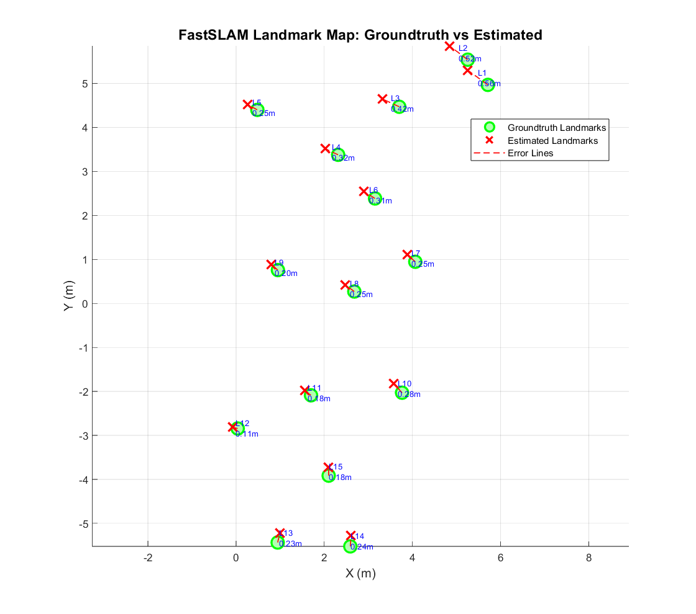

# SLAM Evaluation and Visualization

This repository contains implementations of **FastSLAM 1.0** and **EKF-SLAM** on the MRCLAM dataset, together with tools for evaluation and visualization.

## Running SLAM with Error Metrics

If you want to **compute and visualize error metrics** (ATE, RPE, and landmark RMSE), you should run:

- `fastslam_known_correspondences`
- `ekf_known_correspondences`

These scripts:
- Run the full SLAM pipeline
- Compare estimated trajectories and maps against ground truth
- Produce quantitative error plots (ATE, RPE, landmark RMSE)

They are intended for **offline evaluation and benchmarking**.
You should see something like:

  
   

## Real-Time SLAM Visualization

If you want a **real-time animation** showing how SLAM evolves step by step (robot motion, particle spread, landmark estimates), you should run:

- `slam_gui`

This mode focuses on **intuition and visualization**, not on final quantitative error metrics.

## Summary

- **Error metrics / evaluation** → run  
  `fastslam_known_correspondences` or `ekf_known_correspondences`

- **Real-time SLAM animation** → run  
  `slam_gui`

Both modes use the same underlying models but serve different purposes:  
evaluation vs. visualization.

## Reference
For a detailed explanation of the mathematical derivations, algorithm structure, and experimental results, please refer to the project report included in this repository:

📄 **[Read the Full Paper (PDF)](./Paper.pdf)**
